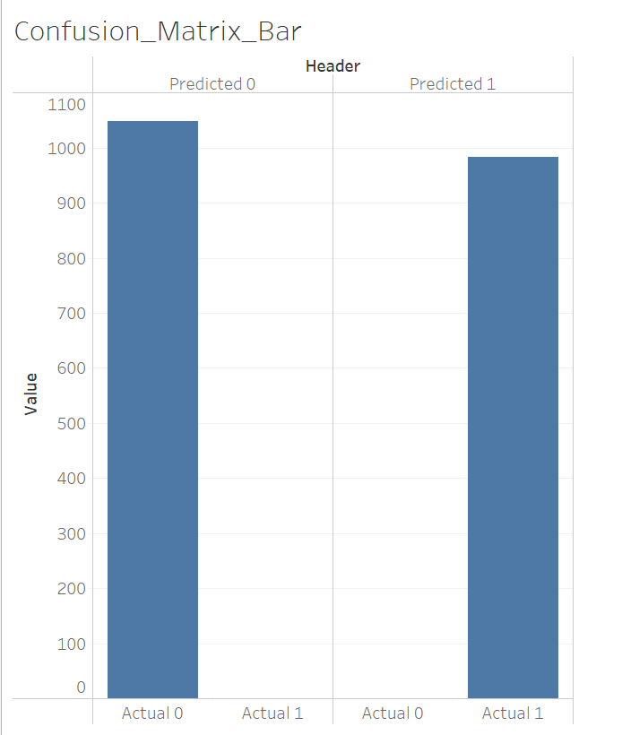

# Mushroom-Analysis

## Selected topic:
- Classifying safe versus poisonous mushrooms.

## Reason for selecting topic:
- All five of us are massive mushroom enthusiasts and need to ensure that we can survive the upcoming climate apocalypse in the wild.

## Description of the data source:
- CSV file with 8,124 instances of mushrooms and their attributes. This data set includes descriptions of hypothetical samples corresponding to 23 species of gilled mushrooms in the Agaricus and Lepiota Family.  
- Each species is identified as definitely edible, definitely poisonous, or of unknown edibility and not recommended (those are lumped in with the poisonous).
- The data comes from The Audobon Society Field Guide to North American Mushrooms (1981) and was contributed to the UCI Machine Learning Repository in 1987.

## Outline of the project:
- We will identify differences in edible versus poisonous mushrooms.
- We will do this by identifying which mushroom characteristics in our dataset help indicate their edibility.
- By classifying our data by different features and creating a target, we can test to confirm safe and poisonous mushrooms and their qualities.

## Questions:
1) Can a machine learning model help evaluate whether a mushroom is edible or poisonous?
2) Which features are most indicative of a poisonous mushroom?
3) Which habitat contains the highest percentage of edible mushrooms?
4) What populations contain the most edible and most poisonous mushrooms?

## Machine Learning Model:
- We want to better understand the classification (edible vs. poisonous) of mushrooms in our dataset. This can be achieved using the Random Forest Classifier 
to precisely classify our data. 
- The Random Forest Classifier is our model of choice as it best validates categorical data. It is an ensemble learning model consisting of several decision tree 
algorithms trained on random subsets of our data. 
- By combining multiple (relatively uncorrelated) decision trees, the Random Forest Classifier protects against overfitting and improves overall accuracy. The 
model also allows us to rank the importance of our input variables and is able to accomodate larger datasets. 

- The following steps will be used for our model:
 * Load clean data
 * Create features table
 * Create target table
 * Split, train, test with train_test_split()
 * Instantiate the model with RandomForestClassifier()
 * Fit the model with model.fit()
 * Make predictions with model.predict()
 * Calculate accuracy score with balanced_accuracy_score()
 * Print classification report with classification_report_imbalanced()
 
### Data Preprocessing:
Using Label Encoder, all textual data was converted into numerical data.

### Features vs Target:
* The features are a copy of the columns from mushrooms.db (from mushrooms.csv), excluding 'id'and 'class'. Features such as cap size, color, bruises, odor, 
ring type, and others are the variables that help evaluate whether a mushroom is edible or poisonous.
* The target is the 'class' column, which indicates wherether a mushroom is poisonous (1) or edible (0).

### Data Training:
* To train the model, the features and target data are split into training and testing sets using the train_test_split() function. 

### Accuracy Score and Confusion Matrix:
* An Accuracy Score and a Confusion Matrix were generated to evaluate the performance of our learning model.
* The Accuracy Score is the percentage of correct predictions in relation to total predictions.
* The Confusion Matrix assessed the precision and recall of our model  by creating a table that categorizes outcomes: True positives, false positives, false negatives, and true negatives.

## Google Slides link:
https://docs.google.com/presentation/d/1TcVUXv8PpJf7bvGHLgkctSf4tc1Di38AYmpPCqDlXzk/edit#slide=id.p

## Tableau link:
https://public.tableau.com/app/profile/bianca.calin1055/viz/MushroomAnalysisv_1/Ediblev_Poisonous
https://public.tableau.com/app/profile/suganya.balasubramanian/viz/MushroomClass_Habitat/Habitat_Class
https://public.tableau.com/app/profile/suganya.balasubramanian/viz/MushroomClass_Habitat_Percent/Habitat_Percent

*Note: These databases will be combined in later steps*

_Potential visualization of confusion matrix to add to Tableau dashboard_

## Steps for creating database in [mushrooms_db_create.ipynb](mushrooms_db_create.ipynb):
- Import dependencies
- Initialize SQLite and create mushrooms.db database
- Read in CSV of mushroom data
- Create features and target DataFrames
- Pull list of column headers from features DataFrame and use f string syntax to create features table in SQLite
- Print "create_features" to ensure that correct column headers have been pulled
- Create features table in SQLite database  (cur.execute)
- Isolate features data from DataFrame
- Insert ensuing values into features table in SQLite database (cur.executemany)
- Create syntax to create target table in SQLite
- Create target table in SQLite database  (cur.execute)
- Isolate target data from DataFrame
- Insert ensuing values into target table in SQLite database
- Write and execute SQL query to make sure database contains both tables (features and targets)

## Steps for running machine learning algorithm in [mushrooms_ml_model.ipynb](mushrooms_ml_model.ipynb):
- Import dependencies
- Connect to mushrooms.db database
- Check list of tables in database
- Create dataframe from joined targets and features tables
- Using Label Encoder, convert all textual data into numerical data
- Define the features and target using dataframe drop method and column selection, respectively
- Split data into training and testing sets
- Scale the features data using StandardScaler()
- Create a Random Forest classifier, fit the model, and make predictions using the model
- Generate the confusion matrix, accuracy score and classification report for our results; export them to CSV files
- Rank feature importance, create corresponding dataframe, and export it to a CSV file

## Summary:

- Based on our analysis, we can conclude that there is a high accuracy score of 1.00, meaning that all predicted outcomes were correct. 
- In a model with discrete outcomes, such as our Random Forest Classifier, a Confusion Matrix offers a better method to evaluate the model's precision (positive predicive value) and sensitivity (recall). Based on our matrix, our model is extremely precise (983 mushrooms that were predicted poisonous were actually poisonous)   and extremely sensitive (1046 mushrooms that were predicted edible were actually edible).
- The F1 score is very low (1.00) meaning that there is no pronounced imbalance between sensitivity and precision.

Did our questions get answered?

1) Can a machine learning model help evaluate whether a mushroom is poisonous or edible?
2) Which features are most indicative of a poisonous mushroom?

We were able to rank the importance of the mushroom features in our Random Forest Classifier model

3) Which habitat contains the highest percentage of edible mushrooms?

 Woods has the highest count of edible mushrooms.
 

4) What populations contain the most edible and most poisonous mushrooms?

## Recommendations for Future Analysis:

Notes on suspiciously high accuracy and ideas for further analysis:

- Many other people online who have run this data through machine learning models also achieved 100% accuracy and wondered if they had done something wrong. We looked at comments on other people's questions about this in Kaggle.
- We could try encoding the data differently. We would need to research pros/cons of one hot encoding vs. label encoding for random forest model, for example.
- Someone suggested the models could be overfitted. If we got our hands on more mushroom data, we could test this.

## Resources:
https://www.kaggle.com/datasets/uciml/mushroom-classification
